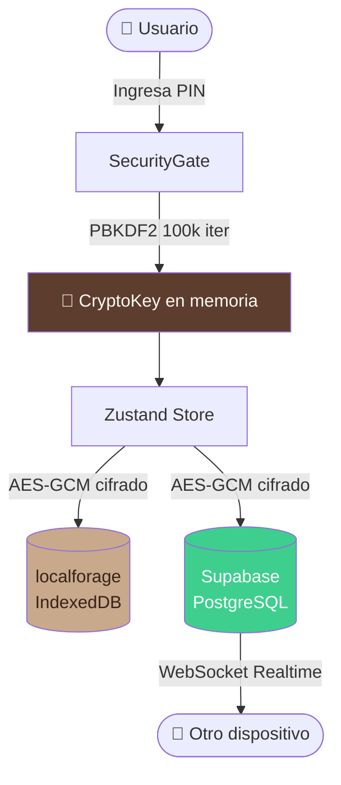
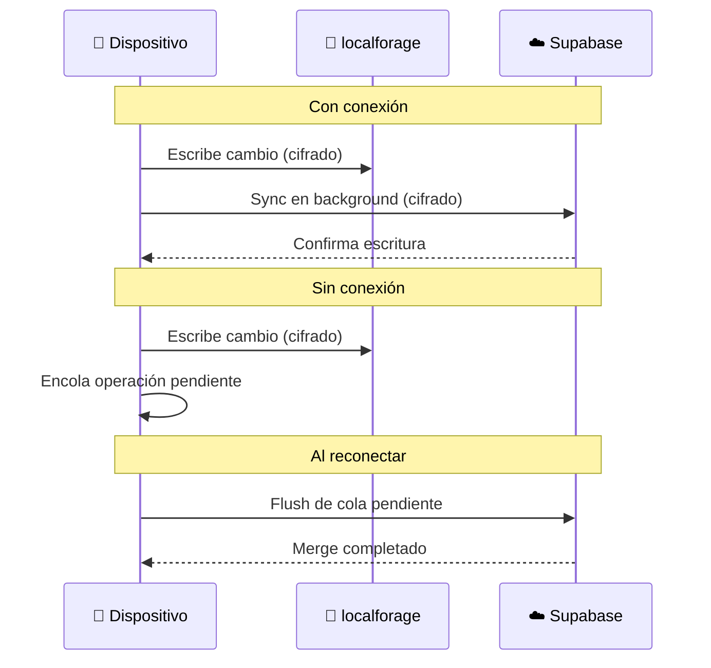
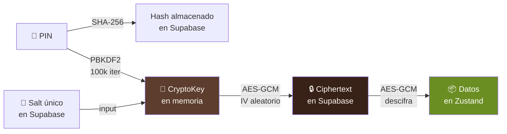
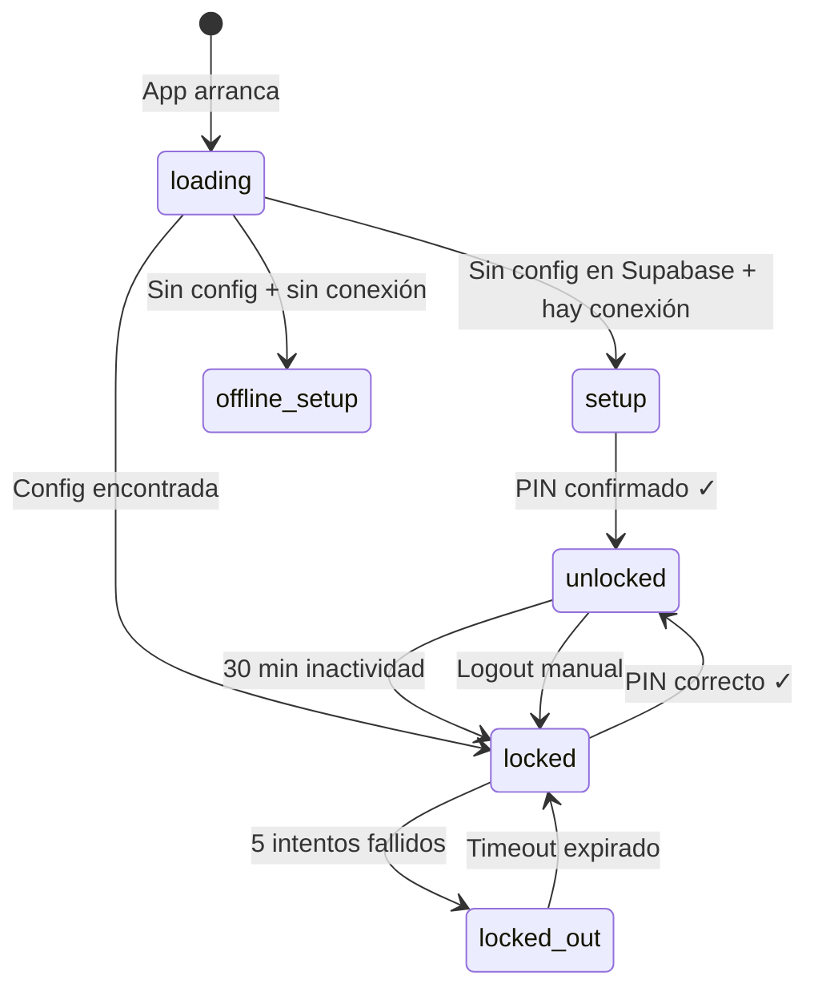
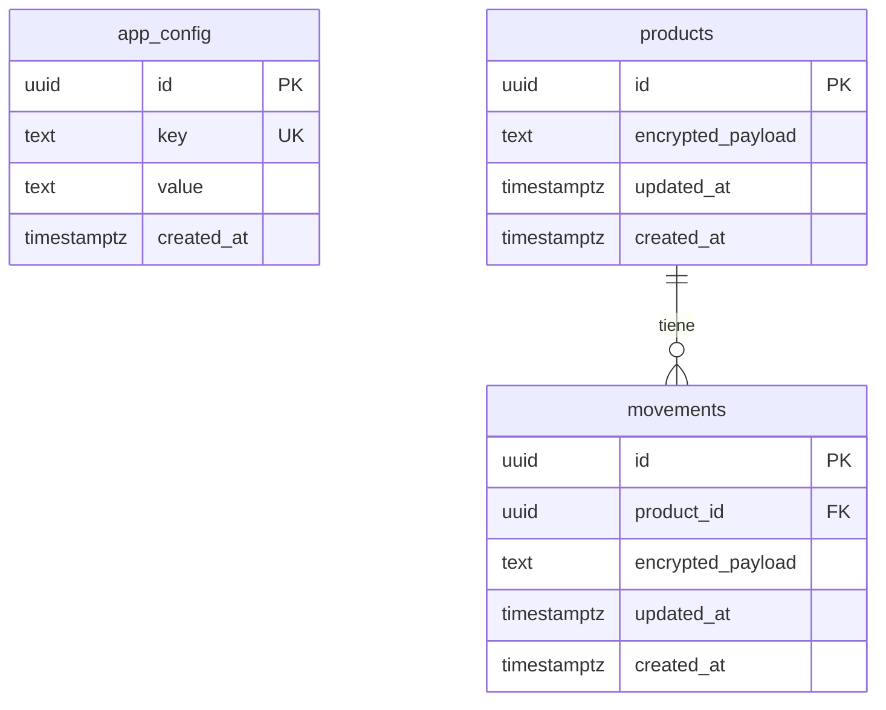

# ☕ Barista Stock Manager

> PWA privada de control de inventario para cafeterías de especialidad.  
> Sincronización en tiempo real entre dispositivos. Datos cifrados end-to-end.  
> Offline-First · Privacy-First · Mobile-First.

<br>


---

## 📋 Tabla de contenidos

- [Características](#-características)
- [Stack tecnológico](#-stack-tecnológico)
- [Arquitectura](#-arquitectura)
- [Seguridad](#-modelo-de-seguridad)
- [Setup local](#-setup-local)
- [Deploy](#-deploy-en-vercel)
- [Estructura del proyecto](#-estructura-del-proyecto)
- [Reset de PIN](#-reset-de-pin)

---

## ✨ Características

| Característica | Descripción |
|----------------|-------------|
| 📱 **Mobile-First** | Diseñado para uso con una mano en barra, área táctil mínima 48px |
| 🔒 **Privacy-First** | Datos cifrados AES-GCM antes de salir del dispositivo |
| 📡 **Offline-First** | Funciona sin conexión, sincroniza al reconectar |
| ⚡ **Tiempo real** | Cambios visibles en todos los dispositivos en < 1 segundo |
| 🔑 **PIN local** | Autenticación sin cuentas, sin emails, sin contraseñas |
| 📦 **PWA instalable** | Se instala como app nativa en iOS y Android |

---

## 🛠 Stack tecnológico

### Frontend

| Tecnología | Versión | Uso |
|-----------|---------|-----|
| React | 19 | UI y componentes |
| TypeScript | 5.9 (strict) | Tipado estricto |
| Tailwind CSS | v4 (CSS-first) | Estilos, sin `tailwind.config.js` |
| Zustand | 5 | Estado global |
| lucide-react | 0.577 | Iconografía |

### Backend & Datos

| Tecnología | Versión | Uso |
|-----------|---------|-----|
| Supabase | SDK 2 | Base de datos + Realtime WebSockets |
| localforage | 1.10 | Persistencia offline (IndexedDB) |
| Zod | 3 | Validación de esquemas en runtime |
| DOMPurify | 3 | Sanitización de inputs (anti-XSS) |

### Build & Deploy

| Tecnología | Versión | Uso |
|-----------|---------|-----|
| Vite | 7 | Bundler y dev server |
| vite-plugin-pwa | 1.2 | Service Worker y manifest |
| Vercel | — | Deploy de producción (automático) |
| Docker | — | Entorno de desarrollo local |

---

## 🏗 Arquitectura

### Flujo de datos



### Sincronización offline-first



### Modelo de cifrado



### Estados de autenticación



---

## 🔐 Modelo de seguridad

### Amenazas cubiertas

| Amenaza | Mitigación |
|---------|-----------|
| Acceso físico al dispositivo | PIN + sesión con expiración de 30 min |
| Fuerza bruta del PIN | Lockout progresivo: 30s → 60s → 120s tras 5 intentos |
| Extensión maliciosa en el browser | Datos cifrados AES-GCM en IndexedDB — solo ciphertext visible |
| XSS stored | DOMPurify sanitiza todos los campos string antes de persistir |
| Acceso directo a Supabase | Solo ve `{ id, encrypted_payload }` — nunca plaintext |
| Intercepción de red | HTTPS + CSP headers + datos ya cifrados en el cliente |

### Por qué cada decisión criptográfica

> **SHA-256 para el PIN hash:** Permite verificar el PIN sin enviarlo por la red. El hash no revela el PIN original.

> **PBKDF2 con 100,000 iteraciones:** Hace que cada intento de fuerza bruta cueste ~100ms. Con 10,000 combinaciones posibles de PIN = mínimo 17 minutos para un ataque completo.

> **AES-GCM (modo autenticado):** Detecta si alguien modificó el ciphertext. Si hay tampering, el descifrado falla con error explícito.

> **IV aleatorio por escritura:** Previene ataques de nonce reuse. Sin IV único, dos textos iguales producirían el mismo ciphertext.

> **Salt en Supabase sin cifrar:** El salt no es secreto — su función es hacer que el mismo PIN derive claves distintas en distintas instalaciones. Guardarlo en Supabase permite que todos los dispositivos deriven la misma CryptoKey con el mismo PIN.

### Limitaciones conocidas

> ⚠️ **Sin auditoría de accesos** — no hay log de quién entró ni desde dónde.  
> ⚠️ **PIN compartido** — todos los dispositivos usan el mismo PIN.  
> ⚠️ **Sin 2FA** — un solo factor de autenticación.

*Para el caso de uso de una cafetería local estas limitaciones son aceptables.*

---

## 🚀 Setup local

### Prerrequisitos

- [Docker Desktop](https://www.docker.com/products/docker-desktop/) instalado y corriendo
- [Git](https://git-scm.com/) instalado
- Cuenta en [Supabase](https://supabase.com) (tier gratuito)

### 1. Clonar el repo

```bash
git clone https://github.com/YaelTriana/barista-stock-manager.git
cd barista-stock-manager
```

### 2. Configurar variables de entorno

Crear `.env.local` en la raíz del proyecto:

```bash
VITE_SUPABASE_URL=https://xxxx.supabase.co
VITE_SUPABASE_ANON_KEY=eyJ...
```

> 💡 Obtener estas claves en: Supabase Dashboard → Settings → API

### 3. Configurar la base de datos

En Supabase Dashboard → **SQL Editor** → ejecutar el contenido de:

```
supabase/migrations/001_initial.sql
```

### 4. Levantar el entorno de desarrollo

```bash
# Primera vez (descarga imagen Node, instala deps ~2 min)
docker compose up dev --build

# Las veces siguientes (~5 segundos)
docker compose up dev
```

La app estará disponible en **http://localhost:5173** con hot-reload.

### Comandos útiles

```bash
# Detener el contenedor
docker compose down

# Limpiar todo (imágenes, volúmenes)
docker compose down --volumes --rmi local

# Ver logs en tiempo real
docker compose logs -f dev
```

---

## ☁️ Deploy en Vercel

El deploy es completamente automático — cada `git push` a `main` redespliega.

### Setup inicial

1. Conectar repo en [vercel.com](https://vercel.com) → **Add New Project**
2. Framework preset: **Vite** (auto-detectado)
3. Agregar variables de entorno en **Settings → Environment Variables**:

```
VITE_SUPABASE_URL
VITE_SUPABASE_ANON_KEY
```

4. **Deploy** → la app queda en `https://barista-stock-manager.vercel.app`

5. Agregar la URL en Supabase → **Authentication → URL Configuration → Site URL**

### Flujo de trabajo

```bash
# Hacer cambios en el código
git add .
git commit -m "feat: descripción del cambio"
git push origin main
# → Vercel redespliega automáticamente en ~30s
```

---

## 📁 Estructura del proyecto

```
barista-stock-manager/
├── .agent/
│   └── skills/                    # Skills para Antigravity AI
│       ├── barista-security/      # Auth, PIN, crypto, Zod
│       ├── barista-store/         # Zustand + sync
│       ├── barista-supabase/      # DB, Realtime, schema
│       ├── barista-ui/            # Componentes, Tailwind v4
│       ├── barista-pwa/           # Vite, PWA, Vercel
│       └── barista-docker/        # Docker dev
├── supabase/
│   └── migrations/
│       └── 001_initial.sql        # Schema inicial
├── src/
│   ├── components/
│   │   ├── auth/
│   │   │   └── SecurityGate.tsx   # Autenticación PIN
│   │   ├── inventory/
│   │   │   └── InventoryList.tsx  # Pantalla de stock
│   │   ├── layout/
│   │   │   └── MainLayout.tsx     # Navbar + layout
│   │   ├── reports/
│   │   │   └── ReportsList.tsx    # Pantalla de reportes
│   │   └── ui/
│   │       └── SyncIndicator.tsx  # Estado de conexión
│   ├── hooks/
│   │   ├── useIdleTimer.ts        # Expiración de sesión
│   │   └── useSession.ts          # Estado de auth
│   ├── lib/
│   │   ├── crypto.ts              # Web Crypto API (AES-GCM, PBKDF2)
│   │   ├── encryptedStorage.ts    # Adapter Zustand + cifrado
│   │   ├── supabase.ts            # Cliente Supabase
│   │   └── sync.ts                # Cola offline + merge
│   ├── schemas/
│   │   ├── product.ts             # Zod schema Product
│   │   └── movement.ts            # Zod schema Movement
│   ├── store/
│   │   └── useInventoryStore.ts   # Store principal Zustand 5
│   ├── App.tsx
│   └── index.css                  # Tema Tailwind v4 (@theme {})
├── AGENT_BRIEF.md                 # Prompt principal para Antigravity
├── Dockerfile.dev                 # Imagen de desarrollo
├── Dockerfile.prod                # Imagen de producción (multi-stage)
├── docker-compose.yml             # Orquestación dev + prod
├── nginx.conf                     # SPA routing + headers seguridad
├── vercel.json                    # Headers CSP + SPA routing
└── .env.local                     # Variables de entorno (no en git)
```

---

## 🔑 Reset de PIN

> ⚠️ **Advertencia:** Resetear el PIN borra todos los datos del inventario. Los datos están cifrados con una clave derivada del PIN — sin el PIN original no hay forma de recuperarlos.

Si necesitas cambiar el PIN, ejecuta en **Supabase Dashboard → SQL Editor**:

```sql
-- Borra configuración de auth (PIN hash + salt)
DELETE FROM app_config WHERE key IN ('pin_hash', 'salt');

-- Borra todos los datos cifrados (no recuperables)
DELETE FROM movements;
DELETE FROM products;
```

Después de esto, la app entrará en modo **setup** y podrás configurar un nuevo PIN desde cero.

---

## 🗄️ Schema de base de datos



> 💡 `encrypted_payload` contiene el JSON cifrado con AES-GCM. Supabase nunca ve el contenido real.

---

## 🎨 Paleta de colores

| Token | Color | Uso |
|-------|-------|-----|
| `bg-cream` | `#FDFBF7` | Fondo principal |
| `coffee-dark` | `#382218` | Títulos |
| `coffee-brown` | `#5C3D2E` | Botones primarios, nav activo |
| `wood-light` | `#EBE1D5` | Superficies de tarjetas |
| `wood-medium` | `#C8A98B` | Bordes, nav inactivo |
| `text-muted` | `#8A7363` | Texto secundario |
| `accent-red` | `#D9534F` | Bajo stock, alertas |
| `accent-green` | `#6B8E23` | Entradas, éxito |

---

<div align="center">
  <br>
  Hecho con ☕ para cafeterías de especialidad
  <br><br>
</div>
